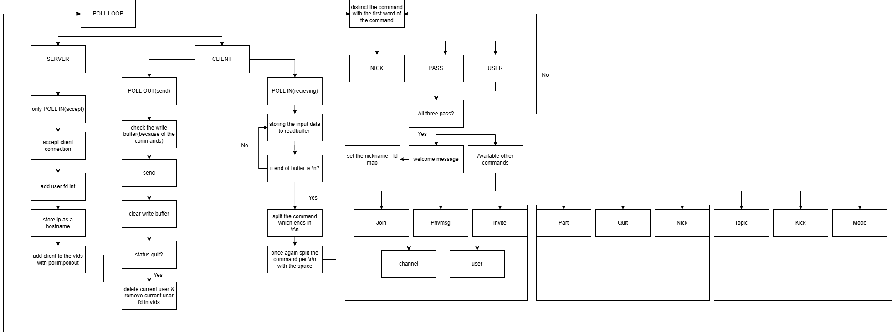

*This project has been created as part of the 42 curriculum by suna, lcao, rxue.*

# ft_irc

## Description

ft_irc is an IRC (Internet Relay Chat) server built in C++98, following the IRC protocol (RFC 2812). The server handles multiple client connections simultaneously using `poll()` for non-blocking I/O multiplexing, allowing users to communicate in real-time through channels and private messages.

### Server Architecture



The server operates around a central **poll loop** that handles two types of events:

- **SERVER (POLL IN)**: Accepts new client connections, assigns a file descriptor, stores the client's IP as hostname, and registers the fd into the poll list with POLLIN/POLLOUT.
- **CLIENT**:
  - **POLL IN (receiving)**: Reads incoming data into a read buffer. Once a complete command (ending with `\r\n`) is received, it is split and parsed by the first word to determine the command type.
  - **POLL OUT (sending)**: Checks the write buffer and sends any pending data to the client, then clears the buffer. If the client's status is marked as quit, the connection is closed and the user is removed.

### Authentication Flow

Before accessing any commands, a client must complete three registration steps:
1. **PASS** - Provide the server password
2. **NICK** - Set a nickname
3. **USER** - Set username information

Once all three are validated, the server sends a welcome message, maps the nickname to the fd, and the client gains access to all available commands.

### Available Commands

| Command | Description |
|---------|-------------|
| **JOIN** | Join a channel (creates it if it doesn't exist) |
| **PRIVMSG** | Send a message to a channel or a user |
| **INVITE** | Invite a user to a channel |
| **PART** | Leave a channel |
| **QUIT** | Disconnect from the server |
| **NICK** | Change nickname |
| **TOPIC** | View or set a channel's topic |
| **KICK** | Remove a user from a channel (operator only) |
| **MODE** | Set channel modes (operator only): `+i` invite-only, `+t` topic restriction, `+k` channel key, `+o` operator privilege, `+l` user limit |

## Instructions

### Compilation

```bash
make
```

This compiles the project with `c++ -Wall -Wextra -Werror -std=c++98`.

### Running the Server

```bash
./ircserv <port> <password>
```

- **port**: Port number (1024-49151)
- **password**: Server connection password

### Connecting with irssi (reference client)

This project was developed and tested using **irssi** as the primary IRC client.

```bash
irssi
```

Then inside irssi:
```
/connect localhost <port> <password> <NICK>
```

### Usage Examples

```
/join #general              # Join or create a channel
/msg #general Hello!        # Send a message to a channel
/msg user1 Hi               # Send a private message
/invite user2 #general      # Invite a user to a channel
/topic #general New topic    # Set the channel topic
/kick #general user2        # Kick a user (operator only)
/mode #general +i           # Set channel to invite-only
/part #general              # Leave a channel
/quit                       # Disconnect from the server
```

## Resources

- [RFC 2812 - Internet Relay Chat: Client Protocol](https://datatracker.ietf.org/doc/html/rfc2812) - The main reference document for IRC protocol rules and specifications used throughout this project.


### AI Usage

AI (Claude) was used in the following areas:
- **C++ syntax**: Assistance with C++98-specific syntax and standard library usage.
- **IRC protocol rules**: Understanding and interpreting RFC 2812 specifications for correct command implementation.
- **poll() concept**: Understanding non-blocking I/O multiplexing with `poll()` for handling multiple client connections.
- **README**: Assistance in writing this README document.
